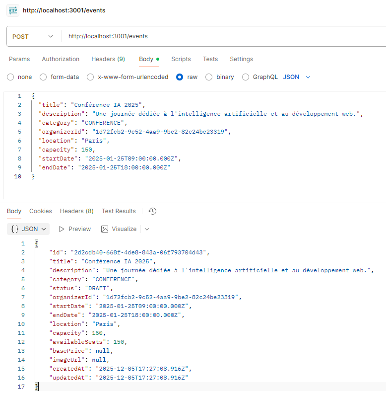
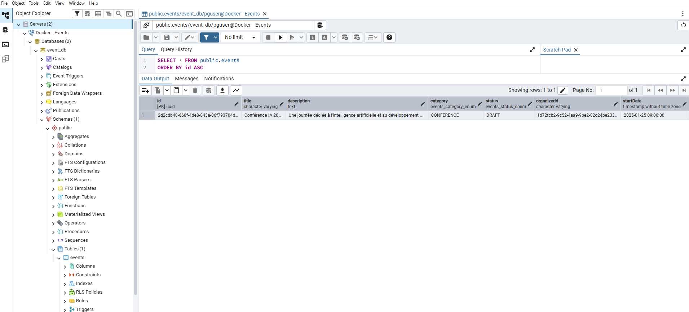

# 📅 Service de Gestion des Événements (Event Service)

Ce microservice gère la création, la modification, la récupération et la
suppression des événements. Il est construit avec **NestJS** et **PostgreSQL**.

## 🚀 Démarrage Rapide

### ✔️ Prérequis

-   Docker & Docker Compose installés
-   Un fichier `.env` à la racine (voir `.env.example`)

## 🛠 Commandes Principales

### 1. 🔄 Reconstruire uniquement le service "Event" (Développement)

``` bash
docker-compose up -d --build event-service
```

### 2. Voir les logs en temps réel

``` bash
docker-compose logs -f event-service
```

### 3. Arrêter le service

``` bash
docker-compose stop event-service
```

## 📍 Accès API

-   Le service tourne sur le port **3001**
-   Documentation rapide : `http://localhost:3001/`

## 📚 Endpoints Disponibles (`/events`)

  GET       `/events`       Liste tous les événements (supporte `?search=xyz`)

  GET       `/events/:id`   Détails d'un événement par ID

  POST      `/events`       Créer un événement

  PATCH     `/events/:id`   Mettre à jour un événement

  DELETE    `/events/:id`   Supprimer un événement

## 🏗 Structure Docker

-   **Container Name :** `event-service`
-   **Port Externe :** `3001`
-   **Base de données :** `postgres-events`
    -   Port interne : `5432`\
    -   Port externe : `5433`

---
# Documentation : Connexion pgAdmin vers Docker PostgreSQL

Ce document décrit la procédure pour connecter une instance locale de pgAdmin à une base de données PostgreSQL tournant dans un conteneur Docker.

## 1. Les paramètres de connexion

Dans **pgAdmin**, suivez ce chemin :
1. Clic droit sur **Servers**
2. Sélectionnez **Register** > **Server...**

### Onglet "General"

* **Name** : `Docker - Events` (ou tout autre nom de votre choix pour identifier ce serveur).

### Onglet "Connection"

C'est ici que la configuration réseau se joue. Il est impératif d'utiliser le **port externe** défini dans votre fichier `docker-compose.yml`.

* **Host name/address** : `localhost`
* **Port** : `5433`
* **Maintenance database** : `postgres` (Laisser par défaut)
* **Username** : `DATABASE_USER` (dans le .env)
* **Password** : `DATABASE_PASSWORD` (dans le .env)

> **Pourquoi le port 5433 ?**
> Dans la configuration `docker-compose`, il est indiqué le mapping `"5433:5432"`.
> * **5432** est le port interne (à l'intérieur du conteneur Docker).
> * **5433** est le port externe (celui accessible depuis votre machine Windows/hôte).

---

## 2. Vérification

Une fois les paramètres enregistrés et la connexion établie :

1. Déroulez le serveur **Docker - Events** dans la barre latérale.
2. Déroulez **Databases**.
3. Vous devriez voir apparaître **`event_db`** dans la liste.

Si la base de données apparaît, la connexion est réussie.




